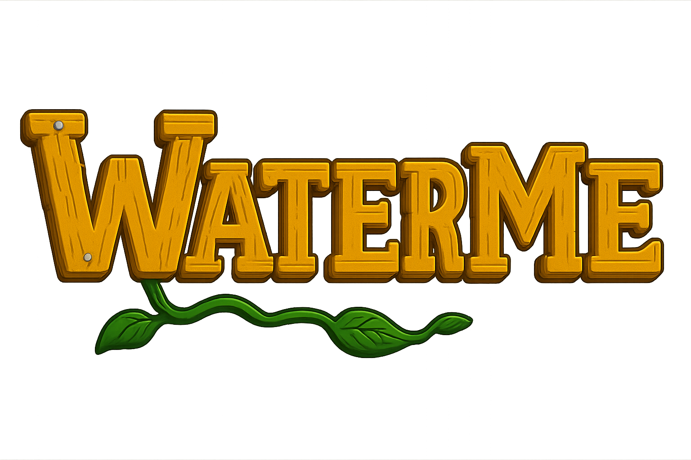

# WaterMe

- WaterMe is your plants' new best friend, keeping them hydrated and happy with smart soil moisture monitoring. 🌱

- Never forget to water your green companions again, thanks to personalized reminders based on each plant's unique needs. 🌱

- Track your plant's vital stats with real-time temperature and moisture data, all wrapped in a delightful pixel-art interface.🌱

- Connect real soil sensors to your virtual garden and watch your plants thrive both online and offline.🌱

## Getting Started
### Storyboard and User story
### Wireframe of APP
### Physical device

## Demo vedio

## How To Install The App
### Dependencies
### Android device
### Simulator

## Contact Details
